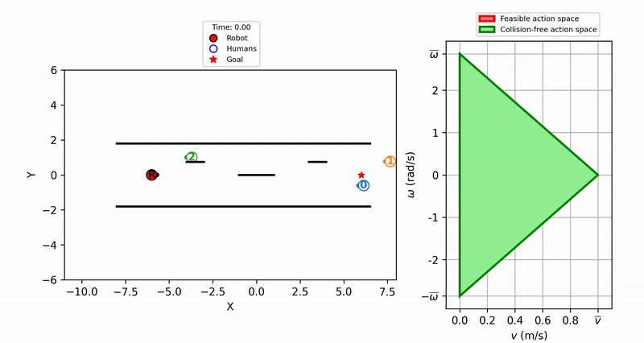
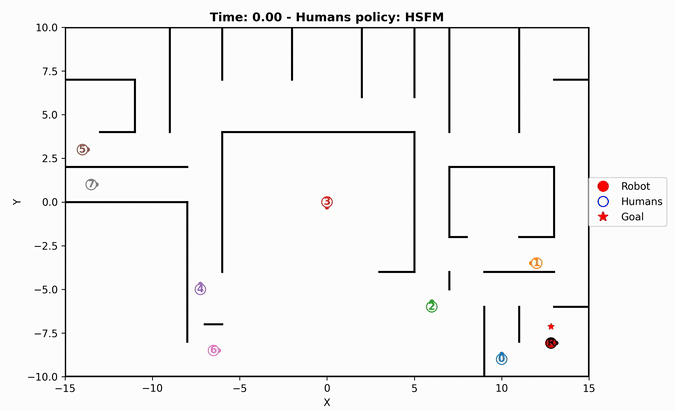
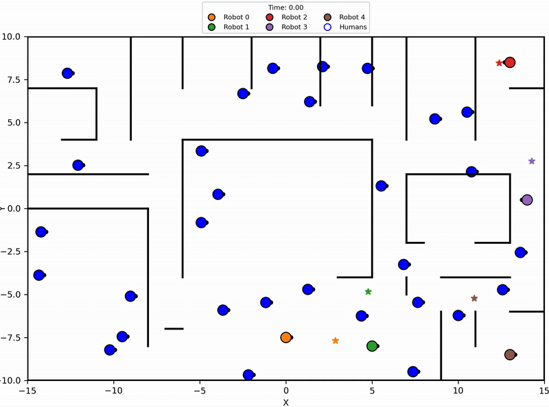

# DIR-SAFE (DIRichlet-based Socially Aware FEasible-action)
A reinforcement learning–based local planner improving [[1]](#sarl) that unifies feasibility, safety, and social compliance for differential-drive robots. The method models the robot’s constrained triangular velocity space using Dirichlet-distributed actions and guarantees collision-free navigation via a lightweight action-space bounding algorithm informed by static obstacle maps. An actor–critic architecture with augmented state inputs enables efficient, real-time action inference without online optimization or simulators.

<b>ATTENTION</b>: Please refer to the [main branch](https://github.com/TommasoVandermeer/social-jym/tree/main) for the latest updates of the social-jym JAX-based simulator. This branch is specifically generated as a showcase for the DIR-SAFE algorithm for social navigation.

<!-- ## Cite this paper
If this repository or paper turns out to be useful for your research, please cite our paper: -->

## Simulation videos
The first video depicts the DIR-SAFE algorithm operating in the parallel traffic scenario with 3 humans and 5 static obstacles. On the left, the video of the complete trajectory is shown and, on the right, the corresponding collision-free action space computed at each step is reported.



The second video shows a simulation in which A* is used as a global planner on top of the DIR-SAFE algorithm to successfully guide the robot from its starting position (bottom right) to its final goal (top left) in a cluttered and crowded environment.



The third video depicts a multi agent simulation of the A* algorithm on top of 5 DIR-SAFE agents. Each agent is guided to its corresponding goal while avoiding collisions in a complex environment.



## Installation
Create a Python virtual environment.
```
virtualenv socialjym
```
Activate the virtual environment.
```
source socialjym/bin/activate
```
Clone the repository and its submodules.
```
git clone --recurse-submodules -b dir-safe https://github.com/TommasoVandermeer/social-jym.git
```
Install the submodules and the main package.
```
pip install -e social-jym/JHSFM
pip install -e social-jym/JSFM
pip install -e social-jym
```

## References
<ul>
    <li id="sarl">[1] Chen, C., Liu, Y., Kreiss, S., & Alahi, A. (2019, May). Crowd-robot interaction: Crowd-aware robot navigation with attention-based deep reinforcement learning. In 2019 international conference on robotics and automation (ICRA) (pp. 6015-6022). IEEE.</li>
</ul>