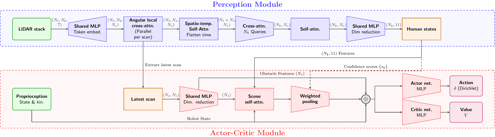

# JESSI (JAX-based End-to-end Safe Social Interpretable navigation)
A novel reinforcement learning framework designed to bring the benefits of multi-task E2E learning into the realm of safe social navigation. Notably, despite integrating a dedicated perception module, JESSI features a deliberately lightweight neural architecture. Implemented using the JAX library, it leverages hardware-accelerated vectorization and just-in-time (JIT) compilation. This combination of compact architecture and JAX compilation enables efficient inference.



## Cite this paper

## Simulation videos

## Real-world experiments videos

## Installation (Python 3.10 or Python 3.13)

Create a virtual environment.
```
virtualenv socialjym
```
Activate the virtual environment.
```
source socialjym/bin/activate
```
Clone the repository and its submodules.
```
git clone --recurse-submodules https://github.com/TommasoVandermeer/social-jym.git
```
Install the submodules and the main package (execution on CPU).
```
pip install -e social-jym social-jym/JHSFM social-jym/JSFM social-jym/JORCA
```
Instead, if you want to run JAX on your GPU (with CUDA12) run:
```
pip install -e social-jym[cuda12] social-jym/JHSFM social-jym/JSFM social-jym/JORCA
```


## References