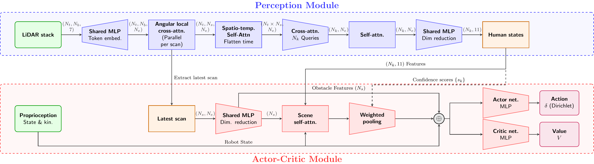
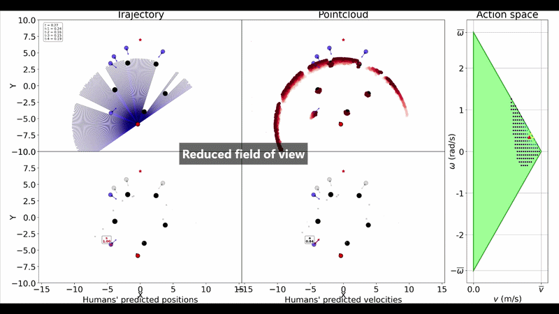

# JESSI (JAX-based End-to-end Safe Social Interpretable navigation)
A novel reinforcement learning framework designed to bring the benefits of multi-task E2E learning into the realm of safe social navigation. Notably, despite integrating a dedicated perception module, JESSI features a deliberately lightweight neural architecture. Implemented using the JAX library, it leverages hardware-accelerated vectorization and just-in-time (JIT) compilation. This combination of compact architecture and JAX compilation enables efficient inference.





## Cite this paper
```
@inproceedings{van2026end,
  title={End-to-End Safe Social Navigation via Multi-Task Reinforcement Learning and Probabilistic Perception},
  author={Van Der Meer, Tommaso and Garulli, Andrea and Giannitrapani, Antonio and Quartullo, Renato and Vaglio, Alberto and Alahi, Alexandre},
  booktitle={2026 IEEE/RSJ International Conference on Intelligent Robots and Systems (IROS)},
  year={2026},
  organization={IEEE}
}
```

## Trained policies (open weights)
You can download the trained policies at this [link](https://drive.google.com/drive/folders/1tgGlOlIsvVTaoK4Ib8Ni5J7KUtjIqGEw?usp=sharing).

Load the weights as
```
import os
import pickle

with open(os.path.join(os.path.dirname(__file__), 'jessi_multitask.pkl'), 'rb') as f:
    network_params, _, _ = pickle.load(f)
```

Checkout ```examples/test_jessi.py``` for usage.

## Installation (Python 3.10 or Python 3.13)

Create a virtual environment.
```
virtualenv socialjym
```
Activate the virtual environment.
```
source socialjym/bin/activate
```
Clone the repository and its submodules.
```
git clone --recurse-submodules https://github.com/TommasoVandermeer/social-jym.git
```
Install the submodules and the main package (execution on CPU).
```
pip install -e social-jym social-jym/JHSFM social-jym/JSFM social-jym/JORCA
```
Instead, if you want to run JAX on your GPU (with CUDA12) run:
```
pip install -e social-jym[cuda12] social-jym/JHSFM social-jym/JSFM social-jym/JORCA
```