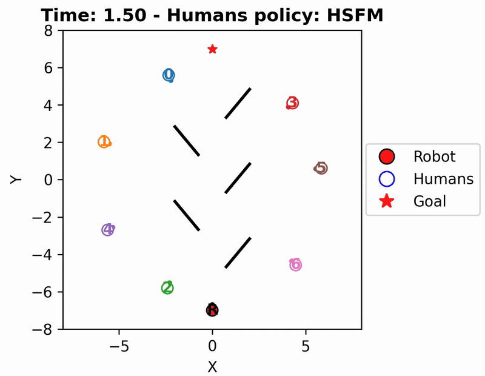

# Environments
This module contatins the available Gym-stile RL environments for <b>social navigation</b>. These environments implement the usual methods used in OpenAI Gyms APIs:
-  <b>step</b>(state, info, action, reset_if_done, reset_key): progresses the state of the environment given the current action and the environment robot_dt (static parameter of the env class). In addition, the env can be automatically reset if the bool reset_if_done = True. The environment will be reset with the given reset_key (for randomness).
-  <b>reset</b>(reset_key): resets the environment based on the env scenario to its initial state using reset_key for stochasticity.
-  <b>_get_obs</b>(state, info, action): computes the robot observation given the current state and the last action taken by the robot.

### Vectorized environments
Methods to run multiple instances of the same environments in parallel are included:
-  <b>batch_step</b>(states, infos, actions, reset_if_done, reset_keys): steps all the environments in parallel.
-  <b>batch_reset</b>(reset_keys): resets all the environments in parallel.

## SocialNav
  
SocialNav is a high-level environment in which it is assumed that the robot has a perfect knowledge of the world state (position and velocities of humans, poisition of static obstacles). Humans are modeled as disks of a certain radius and can move with any human motion model available. Static obstacles are modeled as polygons or single segments.

## LaserNav
LaserNav is an environment in which the robot percieves the world with a 2D LiDAR sensor with predefined parameters. Here also legs dynamics are implemented for humans and the LiDAR rays are casted to collide with these, rather than with disks (to make it more realistic). Static obstacles are modeled as polygons or sigle segments.