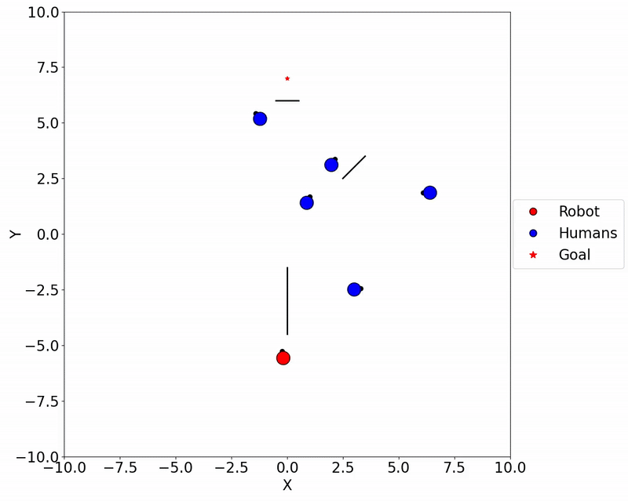

# Environments
This module contatins the available Gym-stile RL environments for <b>social navigation</b>. These environments implement the usual methods used in OpenAI Gyms APIs:
-  <b>step</b>(state, info, action, reset_if_done, reset_key): progresses the state of the environment given the current action and the environment robot_dt (static parameter of the env class). In addition, the env can be automatically reset if the bool reset_if_done = True. The environment will be reset with the given reset_key (for randomness).
-  <b>reset</b>(reset_key): resets the environment based on the env scenario to its initial state using reset_key for stochasticity.
-  <b>_get_obs</b>(state, info): computes the robot observation given the current state.

### Vectorized environments
Methods to run multiple instances of the same environments in parallel are included:
-  <b>batch_step</b>(states, infos, actions, reset_if_done, reset_keys): steps all the environments in parallel.
-  <b>batch_reset</b>(reset_keys): resets all the environments in parallel.

## SocialNav
 <br>
SocialNav is a high-level environment in which it is assumed that the robot has a perfect knowledge of the world state (position and velocities of humans, poisition of static obstacles). Humans are modeled as disks of a certain radius and can move with any human motion model available. Static obstacles are modeled as polygons or single segments.

## LaserNav
LaserNav is an environment in which the robot percieves the world with a 2D LiDAR sensor with predefined parameters. Here also legs dynamics are implemented for humans and the LiDAR rays are casted to collide with these, rather than with disks (to make it more realistic). Static obstacles are modeled as polygons or sigle segments.

## Parameterized API and compatibility

The original `reset`, `step`, `batch_reset`, and `batch_step` APIs are preserved.
They retain the same return arity, observation shapes, and `info` keys so existing
policies and checkpoints continue to work. Parameter generalization is opt-in:

- `reset_with_params` / `batch_reset_with_params` sample one context per episode.
- `step_with_params` / `batch_step_with_params` use that context and resample it
  after an automatic LaserNav episode reset.
- The returned `info` contains private `_robot_params` and `_env_params` keys only
  on this opt-in path. Callers should use the separately returned dictionaries;
  the private keys exist to carry context through JAX environment dynamics.

Robot contexts have a fixed JAX PyTree schema: `radius`, `v_max`,
`wheels_distance`, `control_dt`, `wheel_accel_max`, `tau_linear`, `tau_angular`,
`control_delay_mean`, `control_delay_std`, `actuation_gain`, and `slip_scale`.
LaserNav currently requires `control_dt` to match the constructed environment and
requires a positive wheel distance. This avoids recompiling array shapes or
changing the kinematic model during an episode.

Environment contexts contain sensor period/latency, LiDAR fixed and proportional
noise, dropout, range scale, obstacle noise, visibility probability, and human
scale fields. LaserNav applies sensor timing, LiDAR noise/dropout/range scale, and
robot visibility at runtime. Sensor periods must lie between `humans_dt` and
`robot_dt`, because the simulator retains one control interval of intermediate
sensor history. The remaining environment fields reserve a stable schema for
later curricula and are not yet applied dynamically.

Bounds are partial dictionaries of `(low, high)` pairs. Unspecified values remain
at constructor defaults. For example:

```python
state, key, obs, info, robot_params, env_params, outcome = env.reset_with_params(
    key,
    robot_param_bounds={
        "v_max": (0.36, 0.50),
        "wheels_distance": (0.45, 0.50),
    },
    env_param_bounds={
        "lidar_period": (0.08, 0.25),
        "lidar_dropout_probability": (0.0, 0.05),
    },
)
```

JESSI-S2R is the first policy that consumes this interface. Other policies remain
on the legacy path. To estimate bounds from recorded TurtleBot controller logs:

```bash
python scripts/calibrate_jessi_s2r.py path/to/controller.pkl \
  --output scripts/jessi_s2r_calibration.json
```

The realistic training script loads that manifest when present. Domain
randomization expands from nominal settings to the calibrated bounds over the
first 65% of training, while the existing visibility and scenario curricula
continue independently.

## Numerical failure behavior

JESSI-S2R PPO treats parameters, optimizer states, losses, and gradients as one
transaction. A non-finite candidate update is rejected and training raises a
`FloatingPointError` on the host rather than committing corrupted state and
waiting indefinitely on a CUDA computation. Distribution scales, likelihood
ratios, HSFM overlap forces, and empty episode aggregates are also bounded or
guarded at their sources.

Run the compatibility contracts after environment or policy changes:

```bash
python -m unittest discover -s tests
```
